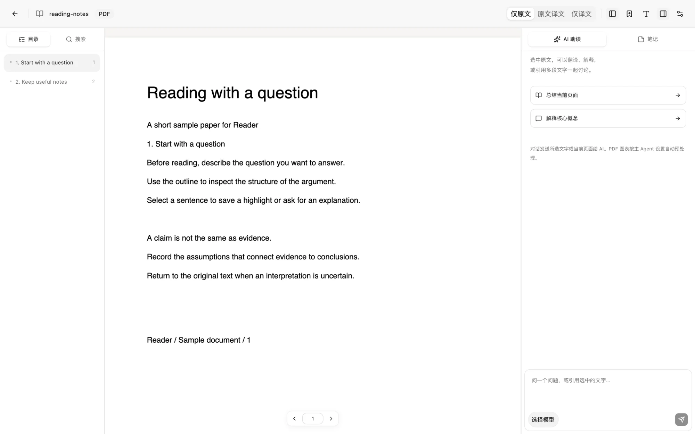
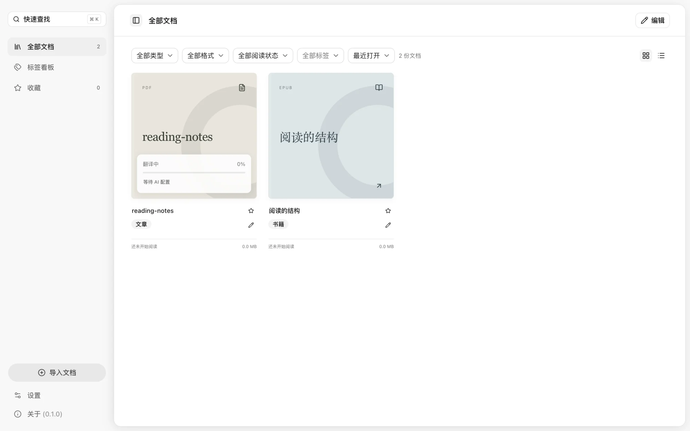
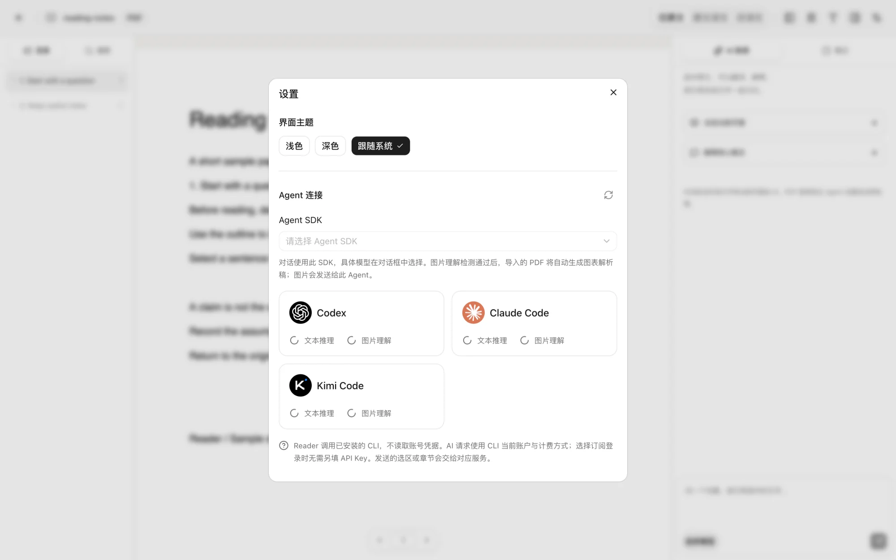

# Reader

**简体中文** | [English](README.en.md) | [官网](https://cynicalight.github.io/reader/)

一个本地优先的 EPUB / PDF AI 阅读器，用于阅读电子书与论文、记录批注，以及结合原文向 AI 提问。

<p align="center">
<picture>
  <source media="(prefers-color-scheme: dark)" srcset="website/assets/screenshots/pdf-dark.webp" />
  
</picture>
</p>

Reader 以 EPUB 和 PDF 为两种核心文档格式。它将图书库与文献库分开管理，并通过 Readium 和 PDF.js 提供目录、搜索、批注与阅读能力。文档、阅读进度和笔记保存在本机；AI 功能通过已登录的 Claude Code、Codex CLI 或 Kimi Code CLI 调用，无需在 Reader 中另填 API Key。

可从[官网](https://cynicalight.github.io/reader/)了解项目，或在 [GitHub Releases](https://github.com/cynicalight/reader/releases) 下载已发布的安装包。也支持从源码运行；发布 Release 后，CI 会构建 macOS（Apple Silicon）的 DMG 和 Windows x64 的 EXE。安装包没有开发者证书，首次运行可能需要允许系统安全提示。流程与验证范围见[安装包与发版说明](docs/releasing.md)。尚未完成 Windows 安装后的人工验收，Linux 不提供安装包。

## 功能

- **图书库与文献库**：分别管理电子书和论文，可在两库间移动文档。图书库支持 EPUB / PDF；文献库只收 PDF，单个文件不超过 50 MB、150 页；页数无法读取时仅检查大小。
- **文献管理**：编辑作者、年份、出处、DOI、arXiv、摘要等信息；通过编号、链接或标题导入论文，在线补全不覆盖手动修改。支持嵌套分类、标签、列表与表格视图、阅读状态、批量操作、重复论文检测与合并、相关文献关联。
- **引用导出**：支持 GB/T 7714、APA、BibTeX 和 RIS，可复制单篇引用或批量导出。
- **回收站**：删除后保留原文件、批注和对话，可撤销或恢复；确认彻底删除后才移除数据。
- **统一阅读界面**：左侧目录与搜索，中间正文，右侧 AI 对话与笔记；可调整侧栏宽度或收起侧栏。
- **PDF 导入处理**：学习中按页解析正文与版面，翻译中翻译正文和图题并把公式图片转为 LaTeX；进度收在书库封面浮层中，依次展示两步，完成后渐隐上浮并收起。可边处理边阅读，悬停已识别的图表／公式区域会显示整块提示。
- **阅读记录**：书签、高亮、下划线、问题批注、批注标签、论文笔记与阅读位置恢复；支持按颜色和标签筛选、摘录批注、Markdown 导出及桌面 `reader://` 链接。PDF 内部引用支持悬停预览和返回阅读位置。
- **AI 助读**：选区翻译与解释、多选区引用、EPUB 当前章节或 PDF 当前页总结、对话历史和生成取消。
- **CLI 账户接入**：检测本机 Claude Code / Codex CLI / Kimi Code CLI 的安装与登录状态，通过官方 CLI 使用已有账户。

文献库的收录限制、联网查找、重复合并与人工检查步骤见[文献库说明](docs/paper-library.md)。

两种格式各自保留适合其排版的阅读方式：

| 能力       | EPUB                                  | PDF                      |
| ---------- | ------------------------------------- | ------------------------ |
| 阅读内核   | Readium Web + Go Toolkit              | PDF.js Viewer            |
| 导航       | 分级目录、章节跳转                    | Outline 目录、页码跳转   |
| 排版       | 分页 / 滚动、字号、字体、行距、页边距 | 连续滚动、缩放、适合宽度 |
| 搜索       | SQLite FTS5，配合字面子串匹配         | 逐页文本搜索             |
| 定位与批注 | Readium locator 与装饰接口            | 页码与归一化选区矩形     |

空书库中可以点击“先体验示例文档”，加载项目附带的原创三章 EPUB 和两页 PDF。

界面支持浅色、深色与跟随系统，桌面窗口外观同步切换。

## 截图

以下截图来自应用本身，使用项目自带的示例文档；图片会跟随 GitHub 的浅色 / 深色外观。

| 书库 | Agent 设置 |
| --- | --- |
| <picture>  <source media="(prefers-color-scheme: dark)" srcset="website/assets/screenshots/library-dark.webp" />  </picture> |  |

## 快速开始

需要 **Node.js 22+、pnpm 10.30.3 和 Go 1.26.5+**。

```sh
git clone https://github.com/cynicalight/reader.git
cd reader
pnpm install
pnpm desktop
```

`pnpm desktop` 会构建 Go 服务、Web 界面和 Electron，然后打开桌面窗口。Go 服务只监听本机的随机端口，并随应用关闭。

若安装时 Electron 二进制未成功下载，可运行以下命令后重试：

```sh
node apps/desktop/node_modules/electron/install.js
```

## 使用 AI

AI 是可选功能。本地阅读、搜索和批注不需要登录 AI 账户。

先安装所需的官方 CLI，并在终端完成登录：

```sh
# 使用 Codex
codex login

# 或使用 Claude Code
claude auth login
```

打开 Reader 设置，指定主 Agent，并检查文字与图片能力检测结果。真实测试通过后显示绿色徽标，等待中的 PDF 翻译会自动继续。文字对话可使用 Codex、Claude Code 或 Kimi Code。Reader 不安装 CLI、不读取其凭据文件，也不自行实现 OAuth。账户权限、额度、模型可用性与计费方式由 CLI 登录和对应服务决定。问答与翻译可分别选择模型及支持的推理强度；未指定时使用对应任务的推荐模型。旧版 CLI 可能需要升级才能支持桥接参数。

首次解析 PDF 会自动下载并校验约 67 MB 的版面模型，缓存后可离线定位图片区域；无需安装 Python 或 PaddlePaddle。未配置通过能力测试的主 Agent 时，正文阅读和图片 hover 仍可用，翻译显示等待配置。退出后会恢复任务并复用已保存译文；扫描页尚不支持 OCR，会明确标记正文不完整。

**调用 AI 时，相关内容会离开本机。** 图片能力测试使用合成图片；启用主 Agent 后，导入 PDF 的正文和图题会发送翻译，公式图片会发送转换为 LaTeX；图表和表格不会发送解析。触发翻译、解释、总结或发送问题后，Reader 会将选区或当前章节 / 页面上下文及最近对话交给 CLI，再由 CLI 请求对应 AI 服务。章节和上下文有长度限制；当前页总结不等于整篇论文总结。

CLI 在临时空目录中运行。Claude 配置为禁用工具与 MCP；Codex 使用只读沙箱并禁用 shell 工具。CLI 的原始日志不会作为回答显示。Codex 通过 App Server 接收增量文字，Claude 使用 stream-json，Kimi 使用 ACP 消息片段；纯文字和图片对话均逐段传输。前端对接约定见 [Agent 流式输出文档](docs/agent-streaming-contract.md)。

## 本地数据

原文件存放在文件系统，文档信息、进度、批注、对话与设置存放在 SQLite。Reader 没有内置云同步。论文元数据查找和在线导入会访问公开的文献服务；自动补全仅发送识别到的 DOI 或 arXiv 编号，可在设置中关闭。

| 运行方式 | 数据目录                                                                                                |
| -------- | ------------------------------------------------------------------------------------------------------- |
| 桌面模式 | Electron `userData` 下的 `library/`；macOS 开发版通常为 `~/Library/Application Support/Reader/library/` |
| 开发模式 | 项目根目录的 `.reader/`                                                                                 |

```text
library/
├── reader.sqlite       # 文档信息、阅读记录、对话、设置与全文索引
├── books/              # EPUB 原文件
├── papers/             # PDF 原文件
├── models/             # 经校验的本地版面模型
├── cache/              # EPUB 资源；PDF analysis 下的 Markdown、图片与解析稿
└── ai-work/            # CLI 临时目录，请求结束后移除
```

备份前先关闭应用，再复制整个数据目录。本地 API 使用每次启动随机生成的 token，并校验 Host / Origin。EPUB 导入会检查压缩包大小、资源路径并清理活动内容；原文件保持原样。

## 开发

启动 Go 服务和带热更新的 Web 界面：

```sh
pnpm dev
```

终端会输出 `http://127.0.0.1:5173/#token=…`，请用完整地址打开。Vite 将请求代理到 `127.0.0.1:17840` 的 Go 服务。该 token 用于本地服务鉴权，不是 AI 账户凭据，请勿分享带 token 的地址。

```sh
pnpm typecheck     # TypeScript 类型检查
pnpm test          # Go 集成测试与 Vitest
pnpm build         # 构建 Go、Web 和 Electron
pnpm api:generate  # 从 OpenAPI 重新生成客户端类型
```

项目官网位于 `website/`，是无需构建的静态 HTML / CSS / JavaScript。本地预览：`python3 -m http.server 4321 -d website`，然后打开 `http://127.0.0.1:4321/`。

测试覆盖文档导入、持久化、资源访问边界、CLI 协议、PDF 解析与部分前端回归。构建和测试通过不能替代真实文档与界面的人工检查，详见[验证记录](docs/verification.md)。

## 技术与结构

前端使用 React、TypeScript、Vite、Tailwind CSS、shadcn/ui（Base UI）和 Zustand。Electron 负责窗口、原生文件选择与 Go 服务生命周期。Go 管理本地文档、SQLite、搜索和 AI CLI 调用。

```text
apps/
├── desktop/       # Electron main / preload
├── web/           # React 界面、PDF.js 与 Readium 阅读适配器
└── server/        # Go 本地服务
packages/
├── ui/            # shadcn/ui + Base UI 组件
├── reader-core/   # Document、Location、TOC、Annotation、ReaderAdapter
└── api-client/    # OpenAPI 类型与 API 客户端
docs/              # 范围、路线图、接口与验证记录
website/           # 项目官网静态页面与 README 截图
```

业务模型围绕 `Document` 组织。PDF 用页码和坐标定位；EPUB 使用章节资源和 locator 定位。阅读界面通过 `ReaderAdapter` 调用各自的引擎。项目使用 pnpm workspace，不依赖 Nx 或 Turborepo。

## 当前限制与后续计划

当前主要面向无 DRM 的可重排 EPUB 与含文本的 PDF。尚未支持 OCR、密码 PDF 输入、PDF 缩略图、后台 PDF 全文索引、批量翻译、跨文档 AI 检索、独立多会话管理、Ollama、API 连接设置界面和阅读统计。API fallback 已有本地后端接口。复杂跨页 PDF 选区暂不创建高亮。

固定版式 EPUB、竖排、RTL、复杂脚注和大文件仍需更多真实样本验证。桌面端已接入 macOS 文件打开事件，但尚未注册系统文件关联，安装包由 CI 构建；尚未提供受系统信任的开发者签名或 macOS 公证。已提供应用内更新检查；macOS 固定证书版本支持原地更新，其他情况下载并安装新版本，具体条件见[发版与更新说明](docs/releasing.md)。

接下来优先完善真实文档的阅读体验，再扩展搜索、数据导出和 AI 功能。详细计划见[路线图](docs/roadmap.md)。

## 参考与致谢

产品交互参考了 [EasyRead](https://github.com/Edwardxlai/easyread) 的本地 AI 阅读与 CLI 账户接入方式。Reader 从空目录独立实现，使用 React / TypeScript 与 Go 构建。

感谢 [Readium](https://github.com/readium)、[PDF.js](https://github.com/mozilla/pdf.js)、[shadcn/ui](https://github.com/shadcn-ui/ui) 和 [Base UI](https://github.com/mui/base-ui)。shadcn 组件保留在 `packages/ui`，相关许可见 [packages/ui/LICENSE.md](packages/ui/LICENSE.md)。更多技术来源与归属见[第三方来源](docs/sources.md)。

[项目范围](docs/spec.md) · [路线图](docs/roadmap.md) · [OpenAPI](docs/openapi.yaml) · [验证记录](docs/verification.md)
